## Pima Indians Diabetes Database Descriptive Statistics Project
### Introduction
Predict the onset of diabetes based on diagnostic measures. This dataset is originally from the National Institute of Diabetes and Digestive and Kidney Diseases. The objective of the dataset is to diagnostically predict whether a patient has diabetes, based on certain diagnostic measurements included in the dataset.

### Columns of the dataset

Pregnancies: Number of times pregnant

Glucose: Plasma glucose concentration 2 hours in an oral glucose tolerance test

Blood Pressure: Diastolic blood pressure (mm Hg)

Skin Thickness: Triceps skin fold thickness

Insulin: 2-Hour serum insulin (mu U/ml)

BMI: Body mass index (weight in kg/(height in m)^2)

Diabetes Pedigree Function: Diabetes pedigree function

Age: Age (years)

Outcome: Class variable (0 or 1) 0 mean non-diabetic and 1 means diabetic


```python
import pandas as pd
```


```python
diabetes=pd.read_csv('diabetes.csv')
```

### Reading the file


```python
diabetes
```


  <div id="df-b90f35dc-7a54-4a5a-8588-50a9e3fd7de3">
    <div class="colab-df-container">
      <div>
<style scoped>
    .dataframe tbody tr th:only-of-type {
        vertical-align: middle;
    }

    .dataframe tbody tr th {
        vertical-align: top;
    }

    .dataframe thead th {
        text-align: right;
    }
</style>
<table border="1" class="dataframe">
  <thead>
    <tr style="text-align: right;">
      <th></th>
      <th>Pregnancies</th>
      <th>Glucose</th>
      <th>BloodPressure</th>
      <th>SkinThickness</th>
      <th>Insulin</th>
      <th>BMI</th>
      <th>DiabetesPedigreeFunction</th>
      <th>Age</th>
      <th>Outcome</th>
    </tr>
  </thead>
  <tbody>
    <tr>
      <th>0</th>
      <td>6</td>
      <td>148</td>
      <td>72</td>
      <td>35</td>
      <td>0</td>
      <td>33.6</td>
      <td>0.627</td>
      <td>50</td>
      <td>1</td>
    </tr>
    <tr>
      <th>1</th>
      <td>1</td>
      <td>85</td>
      <td>66</td>
      <td>29</td>
      <td>0</td>
      <td>26.6</td>
      <td>0.351</td>
      <td>31</td>
      <td>0</td>
    </tr>
    <tr>
      <th>2</th>
      <td>8</td>
      <td>183</td>
      <td>64</td>
      <td>0</td>
      <td>0</td>
      <td>23.3</td>
      <td>0.672</td>
      <td>32</td>
      <td>1</td>
    </tr>
    <tr>
      <th>3</th>
      <td>1</td>
      <td>89</td>
      <td>66</td>
      <td>23</td>
      <td>94</td>
      <td>28.1</td>
      <td>0.167</td>
      <td>21</td>
      <td>0</td>
    </tr>
    <tr>
      <th>4</th>
      <td>0</td>
      <td>137</td>
      <td>40</td>
      <td>35</td>
      <td>168</td>
      <td>43.1</td>
      <td>2.288</td>
      <td>33</td>
      <td>1</td>
    </tr>
    <tr>
      <th>...</th>
      <td>...</td>
      <td>...</td>
      <td>...</td>
      <td>...</td>
      <td>...</td>
      <td>...</td>
      <td>...</td>
      <td>...</td>
      <td>...</td>
    </tr>
    <tr>
      <th>763</th>
      <td>10</td>
      <td>101</td>
      <td>76</td>
      <td>48</td>
      <td>180</td>
      <td>32.9</td>
      <td>0.171</td>
      <td>63</td>
      <td>0</td>
    </tr>
    <tr>
      <th>764</th>
      <td>2</td>
      <td>122</td>
      <td>70</td>
      <td>27</td>
      <td>0</td>
      <td>36.8</td>
      <td>0.340</td>
      <td>27</td>
      <td>0</td>
    </tr>
    <tr>
      <th>765</th>
      <td>5</td>
      <td>121</td>
      <td>72</td>
      <td>23</td>
      <td>112</td>
      <td>26.2</td>
      <td>0.245</td>
      <td>30</td>
      <td>0</td>
    </tr>
    <tr>
      <th>766</th>
      <td>1</td>
      <td>126</td>
      <td>60</td>
      <td>0</td>
      <td>0</td>
      <td>30.1</td>
      <td>0.349</td>
      <td>47</td>
      <td>1</td>
    </tr>
    <tr>
      <th>767</th>
      <td>1</td>
      <td>93</td>
      <td>70</td>
      <td>31</td>
      <td>0</td>
      <td>30.4</td>
      <td>0.315</td>
      <td>23</td>
      <td>0</td>
    </tr>
  </tbody>
</table>
<p>768 rows × 9 columns</p>
</div>
      <button class="colab-df-convert" onclick="convertToInteractive('df-b90f35dc-7a54-4a5a-8588-50a9e3fd7de3')"
              title="Convert this dataframe to an interactive table."
              style="display:none;">

  <svg xmlns="http://www.w3.org/2000/svg" height="24px"viewBox="0 0 24 24"
       width="24px">
    <path d="M0 0h24v24H0V0z" fill="none"/>
    <path d="M18.56 5.44l.94 2.06.94-2.06 2.06-.94-2.06-.94-.94-2.06-.94 2.06-2.06.94zm-11 1L8.5 8.5l.94-2.06 2.06-.94-2.06-.94L8.5 2.5l-.94 2.06-2.06.94zm10 10l.94 2.06.94-2.06 2.06-.94-2.06-.94-.94-2.06-.94 2.06-2.06.94z"/><path d="M17.41 7.96l-1.37-1.37c-.4-.4-.92-.59-1.43-.59-.52 0-1.04.2-1.43.59L10.3 9.45l-7.72 7.72c-.78.78-.78 2.05 0 2.83L4 21.41c.39.39.9.59 1.41.59.51 0 1.02-.2 1.41-.59l7.78-7.78 2.81-2.81c.8-.78.8-2.07 0-2.86zM5.41 20L4 18.59l7.72-7.72 1.47 1.35L5.41 20z"/>
  </svg>
      </button>

  <style>
    .colab-df-container {
      display:flex;
      flex-wrap:wrap;
      gap: 12px;
    }

    .colab-df-convert {
      background-color: #E8F0FE;
      border: none;
      border-radius: 50%;
      cursor: pointer;
      display: none;
      fill: #1967D2;
      height: 32px;
      padding: 0 0 0 0;
      width: 32px;
    }

    .colab-df-convert:hover {
      background-color: #E2EBFA;
      box-shadow: 0px 1px 2px rgba(60, 64, 67, 0.3), 0px 1px 3px 1px rgba(60, 64, 67, 0.15);
      fill: #174EA6;
    }

    [theme=dark] .colab-df-convert {
      background-color: #3B4455;
      fill: #D2E3FC;
    }

    [theme=dark] .colab-df-convert:hover {
      background-color: #434B5C;
      box-shadow: 0px 1px 3px 1px rgba(0, 0, 0, 0.15);
      filter: drop-shadow(0px 1px 2px rgba(0, 0, 0, 0.3));
      fill: #FFFFFF;
    }
  </style>

      <script>
        const buttonEl =
          document.querySelector('#df-b90f35dc-7a54-4a5a-8588-50a9e3fd7de3 button.colab-df-convert');
        buttonEl.style.display =
          google.colab.kernel.accessAllowed ? 'block' : 'none';

        async function convertToInteractive(key) {
          const element = document.querySelector('#df-b90f35dc-7a54-4a5a-8588-50a9e3fd7de3');
          const dataTable =
            await google.colab.kernel.invokeFunction('convertToInteractive',
                                                     [key], {});
          if (!dataTable) return;

          const docLinkHtml = 'Like what you see? Visit the ' +
            '<a target="_blank" href=https://colab.research.google.com/notebooks/data_table.ipynb>data table notebook</a>'
            + ' to learn more about interactive tables.';
          element.innerHTML = '';
          dataTable['output_type'] = 'display_data';
          await google.colab.output.renderOutput(dataTable, element);
          const docLink = document.createElement('div');
          docLink.innerHTML = docLinkHtml;
          element.appendChild(docLink);
        }
      </script>
    </div>
  </div>


### Basic Exploration of data 


```python
diabetes.shape
# The given dataset has got 768 observations and 9 fields
```


    (768, 9)


```python
diabetes.size
# size tells us the total size of the data set like observations * fields.
```


    6912


```python
diabetes.columns
# the fields that are present in our dataset.The fields play a major role in interpretaion.
```


    Index(['Pregnancies', 'Glucose', 'BloodPressure', 'SkinThickness', 'Insulin',
           'BMI', 'DiabetesPedigreeFunction', 'Age', 'Outcome'],
          dtype='object')


```python
diabetes.info()
# info functions gives us the complete info of our data frame.our data is  clearly categorized and shown in this.
'''
In the below we can find the following observations.
Range index is shown 0 to 767
data columns :9 
we can observe the no of null values count in this,for this data set the null values are 0.
Data types of the all the fields is clearly shown.
'''

```

    <class 'pandas.core.frame.DataFrame'>
    RangeIndex: 768 entries, 0 to 767
    Data columns (total 9 columns):
     #   Column                    Non-Null Count  Dtype  
    ---  ------                    --------------  -----  
     0   Pregnancies               768 non-null    int64  
     1   Glucose                   768 non-null    int64  
     2   BloodPressure             768 non-null    int64  
     3   SkinThickness             768 non-null    int64  
     4   Insulin                   768 non-null    int64  
     5   BMI                       768 non-null    float64
     6   DiabetesPedigreeFunction  768 non-null    float64
     7   Age                       768 non-null    int64  
     8   Outcome                   768 non-null    int64  
    dtypes: float64(2), int64(7)
    memory usage: 54.1 KB
    


    '\nIn the below we can find the following observations.\nRange index is shown 0 to 767\ndata columns :9 \nwe can observe the no of null values count in this,for this data set the null values are 0.\nData types of the all the fields is clearly shown.\n'


```python
'''
now we will start exploring and identity the data types statistically.
pregnancies : discrete
Glucose :  continuous
Blood pressure :  continuous
Skin Thickness : continuous
Insulin   :  continuous
BMI      :  continuous
DiabetesPedigreeFunction  : Continuous
Age       :   continuous
outcome : categorical (nominal)
'''

```


    '\nnow we will start exploring and identity the data types statistically.\npregnancies : discrete\nGlucose :  continuous\nBlood pressure :  continuous\nSkin Thickness : continuous\nInsulin   :  continuous\nBMI      :  continuous\nDiabetesPedigreeFunction  : Continuous\nAge       :   continuous\noutcome : categorical (nominal)\n'


```python
diabetes.describe()
# describe function contains all statistical information.
```


  <div id="df-93f3bafc-87b9-4129-ae2c-5f11c99db09e">
    <div class="colab-df-container">
      <div>
<style scoped>
    .dataframe tbody tr th:only-of-type {
        vertical-align: middle;
    }

    .dataframe tbody tr th {
        vertical-align: top;
    }

    .dataframe thead th {
        text-align: right;
    }
</style>
<table border="1" class="dataframe">
  <thead>
    <tr style="text-align: right;">
      <th></th>
      <th>Pregnancies</th>
      <th>Glucose</th>
      <th>BloodPressure</th>
      <th>SkinThickness</th>
      <th>Insulin</th>
      <th>BMI</th>
      <th>DiabetesPedigreeFunction</th>
      <th>Age</th>
      <th>Outcome</th>
    </tr>
  </thead>
  <tbody>
    <tr>
      <th>count</th>
      <td>768.000000</td>
      <td>768.000000</td>
      <td>768.000000</td>
      <td>768.000000</td>
      <td>768.000000</td>
      <td>768.000000</td>
      <td>768.000000</td>
      <td>768.000000</td>
      <td>768.000000</td>
    </tr>
    <tr>
      <th>mean</th>
      <td>3.845052</td>
      <td>120.894531</td>
      <td>69.105469</td>
      <td>20.536458</td>
      <td>79.799479</td>
      <td>31.992578</td>
      <td>0.471876</td>
      <td>33.240885</td>
      <td>0.348958</td>
    </tr>
    <tr>
      <th>std</th>
      <td>3.369578</td>
      <td>31.972618</td>
      <td>19.355807</td>
      <td>15.952218</td>
      <td>115.244002</td>
      <td>7.884160</td>
      <td>0.331329</td>
      <td>11.760232</td>
      <td>0.476951</td>
    </tr>
    <tr>
      <th>min</th>
      <td>0.000000</td>
      <td>0.000000</td>
      <td>0.000000</td>
      <td>0.000000</td>
      <td>0.000000</td>
      <td>0.000000</td>
      <td>0.078000</td>
      <td>21.000000</td>
      <td>0.000000</td>
    </tr>
    <tr>
      <th>25%</th>
      <td>1.000000</td>
      <td>99.000000</td>
      <td>62.000000</td>
      <td>0.000000</td>
      <td>0.000000</td>
      <td>27.300000</td>
      <td>0.243750</td>
      <td>24.000000</td>
      <td>0.000000</td>
    </tr>
    <tr>
      <th>50%</th>
      <td>3.000000</td>
      <td>117.000000</td>
      <td>72.000000</td>
      <td>23.000000</td>
      <td>30.500000</td>
      <td>32.000000</td>
      <td>0.372500</td>
      <td>29.000000</td>
      <td>0.000000</td>
    </tr>
    <tr>
      <th>75%</th>
      <td>6.000000</td>
      <td>140.250000</td>
      <td>80.000000</td>
      <td>32.000000</td>
      <td>127.250000</td>
      <td>36.600000</td>
      <td>0.626250</td>
      <td>41.000000</td>
      <td>1.000000</td>
    </tr>
    <tr>
      <th>max</th>
      <td>17.000000</td>
      <td>199.000000</td>
      <td>122.000000</td>
      <td>99.000000</td>
      <td>846.000000</td>
      <td>67.100000</td>
      <td>2.420000</td>
      <td>81.000000</td>
      <td>1.000000</td>
    </tr>
  </tbody>
</table>
</div>
      <button class="colab-df-convert" onclick="convertToInteractive('df-93f3bafc-87b9-4129-ae2c-5f11c99db09e')"
              title="Convert this dataframe to an interactive table."
              style="display:none;">

  <svg xmlns="http://www.w3.org/2000/svg" height="24px"viewBox="0 0 24 24"
       width="24px">
    <path d="M0 0h24v24H0V0z" fill="none"/>
    <path d="M18.56 5.44l.94 2.06.94-2.06 2.06-.94-2.06-.94-.94-2.06-.94 2.06-2.06.94zm-11 1L8.5 8.5l.94-2.06 2.06-.94-2.06-.94L8.5 2.5l-.94 2.06-2.06.94zm10 10l.94 2.06.94-2.06 2.06-.94-2.06-.94-.94-2.06-.94 2.06-2.06.94z"/><path d="M17.41 7.96l-1.37-1.37c-.4-.4-.92-.59-1.43-.59-.52 0-1.04.2-1.43.59L10.3 9.45l-7.72 7.72c-.78.78-.78 2.05 0 2.83L4 21.41c.39.39.9.59 1.41.59.51 0 1.02-.2 1.41-.59l7.78-7.78 2.81-2.81c.8-.78.8-2.07 0-2.86zM5.41 20L4 18.59l7.72-7.72 1.47 1.35L5.41 20z"/>
  </svg>
      </button>

  <style>
    .colab-df-container {
      display:flex;
      flex-wrap:wrap;
      gap: 12px;
    }

    .colab-df-convert {
      background-color: #E8F0FE;
      border: none;
      border-radius: 50%;
      cursor: pointer;
      display: none;
      fill: #1967D2;
      height: 32px;
      padding: 0 0 0 0;
      width: 32px;
    }

    .colab-df-convert:hover {
      background-color: #E2EBFA;
      box-shadow: 0px 1px 2px rgba(60, 64, 67, 0.3), 0px 1px 3px 1px rgba(60, 64, 67, 0.15);
      fill: #174EA6;
    }

    [theme=dark] .colab-df-convert {
      background-color: #3B4455;
      fill: #D2E3FC;
    }

    [theme=dark] .colab-df-convert:hover {
      background-color: #434B5C;
      box-shadow: 0px 1px 3px 1px rgba(0, 0, 0, 0.15);
      filter: drop-shadow(0px 1px 2px rgba(0, 0, 0, 0.3));
      fill: #FFFFFF;
    }
  </style>

      <script>
        const buttonEl =
          document.querySelector('#df-93f3bafc-87b9-4129-ae2c-5f11c99db09e button.colab-df-convert');
        buttonEl.style.display =
          google.colab.kernel.accessAllowed ? 'block' : 'none';

        async function convertToInteractive(key) {
          const element = document.querySelector('#df-93f3bafc-87b9-4129-ae2c-5f11c99db09e');
          const dataTable =
            await google.colab.kernel.invokeFunction('convertToInteractive',
                                                     [key], {});
          if (!dataTable) return;

          const docLinkHtml = 'Like what you see? Visit the ' +
            '<a target="_blank" href=https://colab.research.google.com/notebooks/data_table.ipynb>data table notebook</a>'
            + ' to learn more about interactive tables.';
          element.innerHTML = '';
          dataTable['output_type'] = 'display_data';
          await google.colab.output.renderOutput(dataTable, element);
          const docLink = document.createElement('div');
          docLink.innerHTML = docLinkHtml;
          element.appendChild(docLink);
        }
      </script>
    </div>
  </div>


```python

```


```python

```

### Calculated appropriate measure of central tendency for Glucose and Outcome variables


```python
diabetes['Glucose'].mean()
# Glucose column is a contionuous data so, the appropriate measure of central tendency is mean , median.
# we found Glucose as skewed ,so median would be approriate .
```


    120.89453125


```python
diabetes['Glucose'].median()

```


    117.0


```python
diabetes['Glucose'].mode()
# as it 
```


    0     99
    1    100
    dtype: int64


```python
diabetes['Outcome'].mode()
# The outcome columns is a  categorical data the appropriate measure for central tendency is mode.
```


    0    0
    dtype: int64


```python
diabetes.head()
```


  <div id="df-e056902d-2949-4ab9-be1f-4d60f5704f90">
    <div class="colab-df-container">
      <div>
<style scoped>
    .dataframe tbody tr th:only-of-type {
        vertical-align: middle;
    }

    .dataframe tbody tr th {
        vertical-align: top;
    }

    .dataframe thead th {
        text-align: right;
    }
</style>
<table border="1" class="dataframe">
  <thead>
    <tr style="text-align: right;">
      <th></th>
      <th>Pregnancies</th>
      <th>Glucose</th>
      <th>BloodPressure</th>
      <th>SkinThickness</th>
      <th>Insulin</th>
      <th>BMI</th>
      <th>DiabetesPedigreeFunction</th>
      <th>Age</th>
      <th>Outcome</th>
    </tr>
  </thead>
  <tbody>
    <tr>
      <th>0</th>
      <td>6</td>
      <td>148</td>
      <td>72</td>
      <td>35</td>
      <td>0</td>
      <td>33.6</td>
      <td>0.627</td>
      <td>50</td>
      <td>1</td>
    </tr>
    <tr>
      <th>1</th>
      <td>1</td>
      <td>85</td>
      <td>66</td>
      <td>29</td>
      <td>0</td>
      <td>26.6</td>
      <td>0.351</td>
      <td>31</td>
      <td>0</td>
    </tr>
    <tr>
      <th>2</th>
      <td>8</td>
      <td>183</td>
      <td>64</td>
      <td>0</td>
      <td>0</td>
      <td>23.3</td>
      <td>0.672</td>
      <td>32</td>
      <td>1</td>
    </tr>
    <tr>
      <th>3</th>
      <td>1</td>
      <td>89</td>
      <td>66</td>
      <td>23</td>
      <td>94</td>
      <td>28.1</td>
      <td>0.167</td>
      <td>21</td>
      <td>0</td>
    </tr>
    <tr>
      <th>4</th>
      <td>0</td>
      <td>137</td>
      <td>40</td>
      <td>35</td>
      <td>168</td>
      <td>43.1</td>
      <td>2.288</td>
      <td>33</td>
      <td>1</td>
    </tr>
  </tbody>
</table>
</div>
      <button class="colab-df-convert" onclick="convertToInteractive('df-e056902d-2949-4ab9-be1f-4d60f5704f90')"
              title="Convert this dataframe to an interactive table."
              style="display:none;">

  <svg xmlns="http://www.w3.org/2000/svg" height="24px"viewBox="0 0 24 24"
       width="24px">
    <path d="M0 0h24v24H0V0z" fill="none"/>
    <path d="M18.56 5.44l.94 2.06.94-2.06 2.06-.94-2.06-.94-.94-2.06-.94 2.06-2.06.94zm-11 1L8.5 8.5l.94-2.06 2.06-.94-2.06-.94L8.5 2.5l-.94 2.06-2.06.94zm10 10l.94 2.06.94-2.06 2.06-.94-2.06-.94-.94-2.06-.94 2.06-2.06.94z"/><path d="M17.41 7.96l-1.37-1.37c-.4-.4-.92-.59-1.43-.59-.52 0-1.04.2-1.43.59L10.3 9.45l-7.72 7.72c-.78.78-.78 2.05 0 2.83L4 21.41c.39.39.9.59 1.41.59.51 0 1.02-.2 1.41-.59l7.78-7.78 2.81-2.81c.8-.78.8-2.07 0-2.86zM5.41 20L4 18.59l7.72-7.72 1.47 1.35L5.41 20z"/>
  </svg>
      </button>

  <style>
    .colab-df-container {
      display:flex;
      flex-wrap:wrap;
      gap: 12px;
    }

    .colab-df-convert {
      background-color: #E8F0FE;
      border: none;
      border-radius: 50%;
      cursor: pointer;
      display: none;
      fill: #1967D2;
      height: 32px;
      padding: 0 0 0 0;
      width: 32px;
    }

    .colab-df-convert:hover {
      background-color: #E2EBFA;
      box-shadow: 0px 1px 2px rgba(60, 64, 67, 0.3), 0px 1px 3px 1px rgba(60, 64, 67, 0.15);
      fill: #174EA6;
    }

    [theme=dark] .colab-df-convert {
      background-color: #3B4455;
      fill: #D2E3FC;
    }

    [theme=dark] .colab-df-convert:hover {
      background-color: #434B5C;
      box-shadow: 0px 1px 3px 1px rgba(0, 0, 0, 0.15);
      filter: drop-shadow(0px 1px 2px rgba(0, 0, 0, 0.3));
      fill: #FFFFFF;
    }
  </style>

      <script>
        const buttonEl =
          document.querySelector('#df-e056902d-2949-4ab9-be1f-4d60f5704f90 button.colab-df-convert');
        buttonEl.style.display =
          google.colab.kernel.accessAllowed ? 'block' : 'none';

        async function convertToInteractive(key) {
          const element = document.querySelector('#df-e056902d-2949-4ab9-be1f-4d60f5704f90');
          const dataTable =
            await google.colab.kernel.invokeFunction('convertToInteractive',
                                                     [key], {});
          if (!dataTable) return;

          const docLinkHtml = 'Like what you see? Visit the ' +
            '<a target="_blank" href=https://colab.research.google.com/notebooks/data_table.ipynb>data table notebook</a>'
            + ' to learn more about interactive tables.';
          element.innerHTML = '';
          dataTable['output_type'] = 'display_data';
          await google.colab.output.renderOutput(dataTable, element);
          const docLink = document.createElement('div');
          docLink.innerHTML = docLinkHtml;
          element.appendChild(docLink);
        }
      </script>
    </div>
  </div>


```python

```


```python

```

###  Finding 5 points data summaries for all the  required columns 


```python
diabetes['Glucose'].describe()
```


    count    768.000000
    mean     120.894531
    std       31.972618
    min        0.000000
    25%       99.000000
    50%      117.000000
    75%      140.250000
    max      199.000000
    Name: Glucose, dtype: float64


```python
diabetes['Pregnancies'].describe()
```


    count    768.000000
    mean       3.845052
    std        3.369578
    min        0.000000
    25%        1.000000
    50%        3.000000
    75%        6.000000
    max       17.000000
    Name: Pregnancies, dtype: float64


```python
diabetes['BloodPressure'].describe()
```


    count    768.000000
    mean      69.105469
    std       19.355807
    min        0.000000
    25%       62.000000
    50%       72.000000
    75%       80.000000
    max      122.000000
    Name: BloodPressure, dtype: float64


```python
diabetes['BMI'].describe()
```


    count    768.000000
    mean      31.992578
    std        7.884160
    min        0.000000
    25%       27.300000
    50%       32.000000
    75%       36.600000
    max       67.100000
    Name: BMI, dtype: float64


```python
diabetes['Insulin'].describe()
```


    count    768.000000
    mean      79.799479
    std      115.244002
    min        0.000000
    25%        0.000000
    50%       30.500000
    75%      127.250000
    max      846.000000
    Name: Insulin, dtype: float64


```python
diabetes['DiabetesPedigreeFunction'].describe()
```


    count    768.000000
    mean       0.471876
    std        0.331329
    min        0.078000
    25%        0.243750
    50%        0.372500
    75%        0.626250
    max        2.420000
    Name: DiabetesPedigreeFunction, dtype: float64


```python
diabetes['Age'].describe()
```


    count    768.000000
    mean      33.240885
    std       11.760232
    min       21.000000
    25%       24.000000
    50%       29.000000
    75%       41.000000
    max       81.000000
    Name: Age, dtype: float64


```python

```


```python

```

###  Created an appropriate plot to examine the relationship between Age and Glucose.


```python
from matplotlib import pyplot as plt
import seaborn as sns

```


```python
x=diabetes['Age']
y=diabetes['Glucose']
plt.figure(figsize=(20,10))
plt.title('Relationship between age and Glucose')
plt.scatter(x,y)
ylabel='Glucose'
xlabel='Age'
plt.show()
# the best plot for comparison of two continous variables is scatter plot

```


    
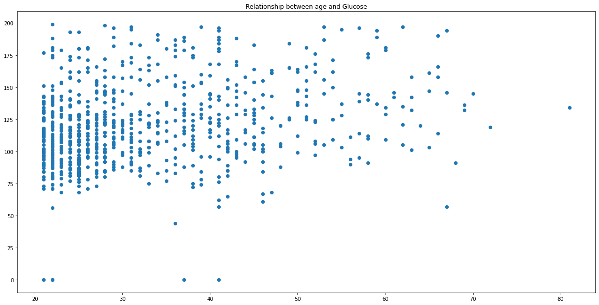
    


```python
x=diabetes['Age']
y=diabetes['Glucose']
plt.figure(figsize=(20,10))
plt.title('Relationship between age and Glucose')
sns.boxplot(x,y)
ylabel='Glucose'
xlabel='Age'
plt.show()

```

    /usr/local/lib/python3.7/dist-packages/seaborn/_decorators.py:43: FutureWarning: Pass the following variables as keyword args: x, y. From version 0.12, the only valid positional argument will be `data`, and passing other arguments without an explicit keyword will result in an error or misinterpretation.
      FutureWarning
    


    
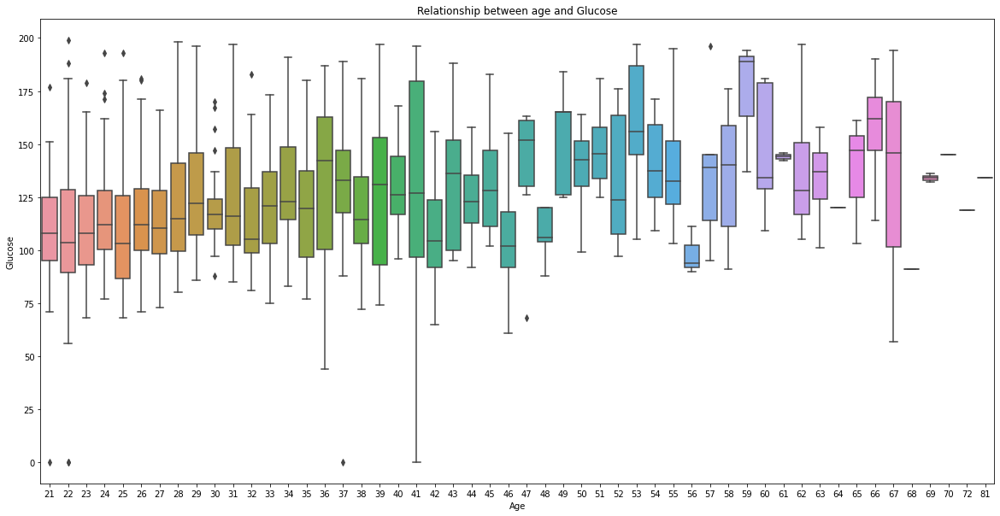
    


```python

```


```python

```


```python

```

### Created an appropriate plot to see the distribution of Outcome variable


```python
k=diabetes['Outcome']
sns.countplot(k)
plt.show()
# Outcome is categorical data. The categorization is clearly shown below.
```

    /usr/local/lib/python3.7/dist-packages/seaborn/_decorators.py:43: FutureWarning: Pass the following variable as a keyword arg: x. From version 0.12, the only valid positional argument will be `data`, and passing other arguments without an explicit keyword will result in an error or misinterpretation.
      FutureWarning
    


    
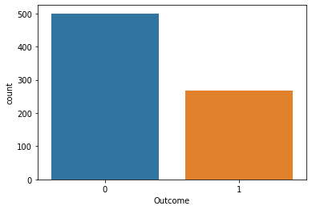
    


```python

```


```python

```

### Examined the distribution of numerical data and explaind which variable normally distributed and  which variable is seems to be skewed. Please also tell the direction of skewness.


```python
print('mean :',diabetes['BloodPressure'].mean())
print('median :',diabetes['BloodPressure'].median())
print('mode :',diabetes['BloodPressure'].mode())
print('skewness :',diabetes['BloodPressure'].skew())
# Blood pressure is skewed . The direction of skewness is left skewed as median is greater than mean.
```

    mean : 69.10546875
    median : 72.0
    mode : 0    70
    dtype: int64
    skewness : -1.8436079833551302
    


```python
print('mean :',diabetes['Pregnancies'].mean())
print('median :',diabetes['Pregnancies'].median())
print('mode :',diabetes['Pregnancies'].mode())
print('skewness :',diabetes['Pregnancies'].skew())
# Pregnancies is skewed.The direction of skewness is right skewed as mean is greater than median .
```

    mean : 3.8450520833333335
    median : 3.0
    mode : 0    1
    dtype: int64
    skewness : 0.9016739791518588
    


```python
print('mean :',diabetes['Glucose'].mean())
print('median :',diabetes['Glucose'].median())
print('mode :',diabetes['Glucose'].mode())
print('skewness :',diabetes['Glucose'].skew())
# Glucose is skewed. The direction of skewness is right skewed as mean is greater than median.
```

    mean : 120.89453125
    median : 117.0
    mode : 0     99
    1    100
    dtype: int64
    skewness : 0.17375350179188992
    


```python

print('mean :',diabetes['SkinThickness'].mean())
print('median :',diabetes['SkinThickness'].median())
print('mode :',diabetes['SkinThickness'].mode())
print('skewness :',diabetes['SkinThickness'].skew())
# SkinThickness is symmetric data . As mean and median approximately equal.
```

    mean : 20.536458333333332
    median : 23.0
    mode : 0    0
    dtype: int64
    skewness : 0.10937249648187608
    


```python
print('mean :',diabetes['Insulin'].mean())
print('median :',diabetes['Insulin'].median())
print('mode :',diabetes['Insulin'].mode())
print('skewness :',diabetes['Insulin'].skew())
# Insulin is a skewed . The direction of skewness is Right skewed as mean greater than median.
```

    mean : 79.79947916666667
    median : 30.5
    mode : 0    0
    dtype: int64
    skewness : 2.272250858431574
    


```python
print('mean :',diabetes['BMI'].mean())
print('median :',diabetes['BMI'].median())
print('mode :',diabetes['BMI'].mode())
print('skewness :',diabetes['BMI'].skew())
# BMI is a symmetric or normally distributed. As median , mean and mode  all are equal.
```

    mean : 31.992578124999977
    median : 32.0
    mode : 0    32.0
    dtype: float64
    


```python
print('mean :',diabetes['DiabetesPedigreeFunction'].mean())
print('median :',diabetes['DiabetesPedigreeFunction'].median())
print('mode :',diabetes['DiabetesPedigreeFunction'].mode())
print('skewness :',diabetes['DiabetesPedigreeFunction'].skew())
# DiabetesPedigreeFunction is a skewed.The direction of skewness is right skewed as mean is greater than median.
```

    mean : 0.4718763020833327
    median : 0.3725
    mode : 0    0.254
    1    0.258
    dtype: float64
    skewness : 1.919911066307204
    


```python
print('mean :',diabetes['Age'].mean())
print('median :',diabetes['Age'].median())
print('mode :',diabetes['Age'].mode())
print('skewness :',diabetes['Age'].skew())
# Age is a skewed . The direction of skewness is right skewed as mean is greater than median.
```

    mean : 33.240885416666664
    median : 29.0
    mode : 0    22
    dtype: int64
    skewness : 1.1295967011444805
    


```python

```


```python

```


```python

```

### Calculated the skewness value and divided variables into symmetrical, moderately skewed and highly skewed.


```python
'''
1.If the skewness is between -0.5 and 0.5, the data are fairly symmetrical.
2.If the skewness is between -1 and -0.5 (negatively skewed) or between 0.5 and 1 (positively skewed), the data are moderately skewed.
3.If the skewness is less than -1 (negatively skewed) or greater than 1 (positively skewed), the data are highly skewed.
'''
```


```python
a=diabetes.skew()
a
```


    Pregnancies                 0.901674
    Glucose                     0.173754
    BloodPressure              -1.843608
    SkinThickness               0.109372
    Insulin                     2.272251
    BMI                        -0.428982
    DiabetesPedigreeFunction    1.919911
    Age                         1.129597
    Outcome                     0.635017
    dtype: float64


```python
index_position=0
for i in a:
  if i < 0.5 and i>-0.5:
    print(f'In {a.index[index_position]} the skewness is between -0.5 and 0.5, the data are fairly symmetrical. ')
    index_position+=1
  elif (i<1 and i>0.5) or (i<-0.5 and i>-1):
    print(f'In {a.index[index_position]} the skewness is between -1 and -0.5 (negatively skewed) or between 0.5 and 1 (positively skewed), the data are moderately skewed.')
    index_position+=1
  else:
    print(f'In {a.index[index_position]}  the skewness is less than -1 (negatively skewed) or greater than 1 (positively skewed), the data are highly skewed.')
    index_position+=1


```

    In Pregnancies the skewness is between -1 and -0.5 (negatively skewed) or between 0.5 and 1 (positively skewed), the data are moderately skewed.
    In Glucose the skewness is between -0.5 and 0.5, the data are fairly symmetrical. 
    In BloodPressure  the skewness is less than -1 (negatively skewed) or greater than 1 (positively skewed), the data are highly skewed.
    In SkinThickness the skewness is between -0.5 and 0.5, the data are fairly symmetrical. 
    In Insulin  the skewness is less than -1 (negatively skewed) or greater than 1 (positively skewed), the data are highly skewed.
    In BMI the skewness is between -0.5 and 0.5, the data are fairly symmetrical. 
    In DiabetesPedigreeFunction  the skewness is less than -1 (negatively skewed) or greater than 1 (positively skewed), the data are highly skewed.
    In Age  the skewness is less than -1 (negatively skewed) or greater than 1 (positively skewed), the data are highly skewed.
    In Outcome the skewness is between -1 and -0.5 (negatively skewed) or between 0.5 and 1 (positively skewed), the data are moderately skewed.
    


```python

```


```python

```


```python

```

### Created appropriate plot to examine the outliers of these variables and also mentioned the  name of the variables which have outliers.


```python
'''
All the below varibles have outliers
pregnancies
BloodPressure 
Insulin 
BMI 
DiabetesPedigreeFunction
Age

Glucose and SkinThickness had only one outlier.
'''
```


```python
import matplotlib.pyplot as plt
import seaborn as sns
```


```python
diabetes.columns
```


    Index(['Pregnancies', 'Glucose', 'BloodPressure', 'SkinThickness', 'Insulin',
           'BMI', 'DiabetesPedigreeFunction', 'Age', 'Outcome'],
          dtype='object')


```python
plt.figure(figsize=(5,5))
plt.title('box plot to see outliners')
sns.boxplot(data=diabetes,x=( diabetes['Pregnancies']))
plt.show()
```


    
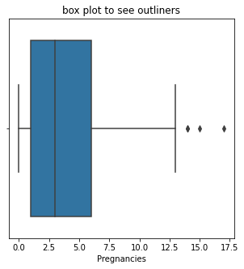
    


```python
plt.figure(figsize=(5,5))
plt.title('box plot to see outliners')
sns.boxplot(data=diabetes,x=( diabetes['Glucose']))
plt.show()
```


    
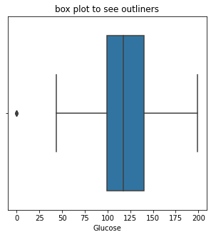
    


```python
plt.figure(figsize=(5,5))
plt.title('box plot to see outliners')
sns.boxplot(data=diabetes,x=( diabetes['BloodPressure']))
plt.show()
```


    
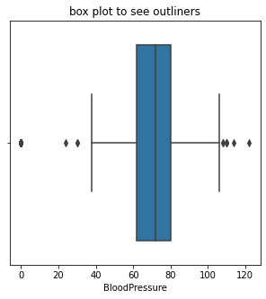
    


```python
plt.figure(figsize=(5,5))
plt.title('box plot to see outliners')
sns.boxplot(data=diabetes,x=( diabetes['SkinThickness']))
plt.show()
```


    
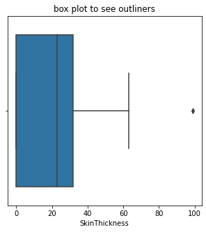
    


```python
plt.figure(figsize=(5,5))
plt.title('box plot to see outliners')
sns.boxplot(data=diabetes,x=( diabetes['Insulin']))
plt.show()
```


    
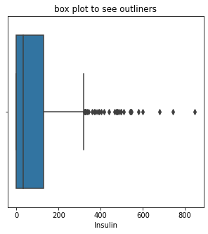
    


```python
plt.figure(figsize=(5,5))
plt.title('box plot to see outliners')
sns.boxplot(data=diabetes,x=( diabetes['BMI']))
plt.show()
```


    
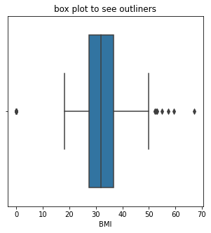
    


```python
plt.figure(figsize=(5,5))
plt.title('box plot to see outliners')
sns.boxplot(data=diabetes,x=( diabetes['DiabetesPedigreeFunction']))
ylabel='index'
xlabel='columns'
plt.show()
```


    
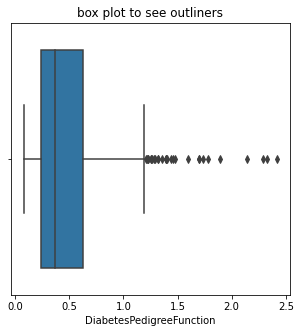
    


```python
plt.figure(figsize=(5,5))
plt.title('box plot to see outliners')
sns.boxplot(data=diabetes,x=( diabetes['Age']))
plt.show()
```


    
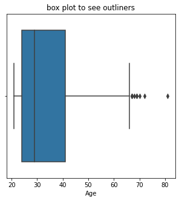
    


```python

```


```python

```


```python

```

### Found the measures of central tendency and dispersion for skewed data


```python
'''
Median and Inter Quartile range are the best measures of centreal tendency and dispersion for skewed data . They are not influence by outlers.
Below i mentioned median and Inter quartile range of all variables.
'''

```


```python
import numpy as np
```


```python
q3,q1=np.percentile(diabetes['Pregnancies'],[75,25])
iqr=q3-q1
print('IQR :',iqr)
print('Median :',diabetes['Pregnancies'].median())
```

    IQR : 5.0
    Median : 3.0
    


```python
q3,q1=np.percentile(diabetes['Insulin'],[75,25])
iqr=q3-q1
print('IQR :',iqr)
print('Median :',diabetes['Insulin'].median())
```

    IQR : 127.25
    Median : 30.5
    


```python
q3,q1=np.percentile(diabetes['Glucose'],[75,25])
iqr=q3-q1
print('IQR :',iqr)
print('Median :',diabetes['Glucose'].median())
```

    IQR : 41.25
    Median : 117.0
    


```python
q3,q1=np.percentile(diabetes['BloodPressure'],[75,25])
iqr=q3-q1
print('IQR :',iqr)
print('Median :',diabetes['BloodPressure'].median())
```

    IQR : 18.0
    Median : 72.0
    


```python
q3,q1=np.percentile(diabetes['SkinThickness'],[75,25])
iqr=q3-q1
print('IQR :',iqr)
print('Median :',diabetes['SkinThickness'].median())
```

    IQR : 32.0
    Median : 23.0
    


```python
q3,q1=np.percentile(diabetes['BMI'],[75,25])
iqr=q3-q1
print('IQR :',iqr)
print('Median :',diabetes['BMI'].median())
```

    IQR : 9.3
    Median : 32.0
    


```python
q3,q1=np.percentile(diabetes['DiabetesPedigreeFunction'],[75,25])
iqr=q3-q1
print('IQR :',iqr)
print('Median :',diabetes['DiabetesPedigreeFunction'].median())
```

    IQR : 0.38249999999999995
    Median : 0.3725
    


```python
q3,q1=np.percentile(diabetes['Age'],[75,25])
iqr=q3-q1
print('IQR :',iqr)
print('Median :',diabetes['Age'].median())
```

    IQR : 17.0
    Median : 29.0
    


```python

```
